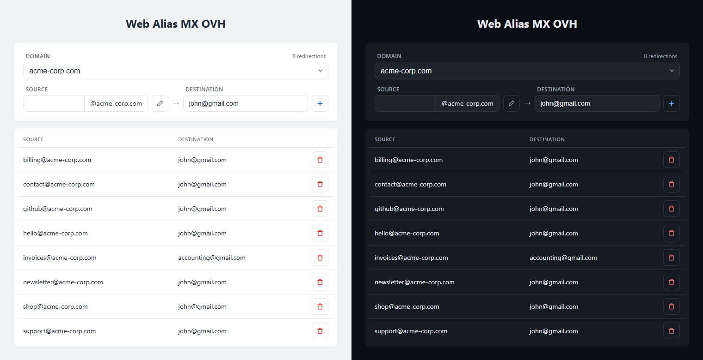

<div align="center">
<h1>Web Alias MX OVH</h1>
A lightweight web UI to manage OVH email redirections.

*Une interface web légère pour gérer les redirections email OVH.*

No npm &middot; No build step &middot; No framework &middot; Pure PHP

<a href="docs/screenshot.png"></a>
</div>

## About
OVH email plans don't support `user+tag@domain.tld` aliases.
Every time you sign up for a new service, you need a new redirection like `you.service@domain.tld` → `you@domain.tld`, and the OVH admin panel is painfully slow for this.
This tool lets you add and remove redirections in seconds.

### Features
- Multi-domain support with domain selector
- Source field auto-fills `@domain.tld`
- Remembers last selected domain
- Alphabetically sorted redirection list
- Add / delete in one click
- Light and dark theme, mobile responsive

### Requirements
- PHP >= 7.4 with the `curl` extension (any PHP hosting works — shared hosting, Apache/mod_php, nginx/Caddy + PHP-FPM)
- `apcu` is optional: when present it caches the API clock offset and the last listing. Without it only the clock offset is cached, in a private temp file — a redirection listing never leaves memory, since the fallback directory is shared with whatever else runs on the host
- OVH API credentials → [create a token](https://eu.api.ovh.com/createToken/) with these rights:
  - GET on `/email/domain/*`
  - POST on `/email/domain/*`
  - DELETE on `/email/domain/*`

## Setup
### 1. Clone
```bash
git clone https://github.com/NSO73/Web-Alias-MX-OVH.git
```

### 2. Configure
```bash
cp config.example.php config.php
```
Fill in your OVH credentials, then list the domains you want to manage. Each domain key maps to a default destination email, pre-filled in the form:

```php
'domains' => [
  'domain.tld' => 'you@domain.tld',
  'other.com'  => 'you@other.com',
],
```

`config.php` is ignored by Git and holds your API secrets, so `chmod 600` it. Better still, keep it out of the document root entirely and point `WAMX_CONFIG` at it:

```bash
install -m 600 config.php /etc/wamx/config.php
```

Two optional config keys tune the rest. `list_cache_ttl` (default `10`) is how many seconds a
complete listing may be reused for: it makes switching between domains instant, at the cost of
a change made in the OVH panel taking that long to show up here — set `0` to always ask OVH.
`require_auth` (default `false`) is covered under [Deployment](#deployment).

Two environment variables are read, both optional:

| Variable | Default | Purpose |
|---|---|---|
| `WAMX_CONFIG` | `config.php` next to `api.php` | Where to read the configuration from |
| `WAMX_CACHE_DIR` | the system temp directory | Where the file cache lives when `apcu` is absent |

### 3. Serve
Serve the project folder with any PHP-capable web server: it serves the static files (`index.html`, `style.css`, `app.js`) and runs `api.php`. No process to keep running, no port to manage.

For a quick local test, use PHP's built-in server:
```bash
php -S localhost:8080
```
Open <http://localhost:8080>.

## Deployment
### Caddy + PHP-FPM
The app has no built-in authentication. Add `basic_auth` (or any other auth mechanism) at the web server level to protect access.

```
domain.tld {
    basic_auth {
        user hash_bcrypt
    }
    root * /path/to/Web-Alias-MX-OVH
    php_fastcgi unix//run/php/php-fpm.sock {
        env WAMX_CONFIG /etc/wamx/config.php
        env REMOTE_USER {http.auth.user.id}
    }
    file_server

    # The assets carry no version in their name, so they must revalidate: otherwise a
    # browser keeps yesterday's app.js against today's api.php after a deploy.
    @assets path *.html *.css *.js
    header @assets Cache-Control "no-cache"

    header {
        Content-Security-Policy "default-src 'self'; script-src 'self'; style-src 'self'; img-src 'self' data:; base-uri 'none'; form-action 'none'; frame-ancestors 'none'; object-src 'none'"
        X-Content-Type-Options nosniff
        Referrer-Policy no-referrer
    }
}
```

Generate `hash_bcrypt` with:
```bash
caddy hash-password --plaintext "password"
```

`env REMOTE_USER` is what lets PHP see who authenticated. Set `'require_auth' => true` in `config.php` once it is in place: the app then answers `401` to any request that reached it without an authenticated user, so a vhost that loses its `basic_auth` block fails closed instead of serving the tool to the internet.

### Apache / nginx
Any standard PHP setup works too — point the document root at the project folder so `index.html` is served and `.php` files are executed by PHP-FPM or mod_php. Pass `WAMX_CONFIG` through `SetEnv` (Apache) or `fastcgi_param` (nginx), or drop `config.php` next to `api.php` and skip it. The same `Cache-Control`, `Content-Security-Policy`, `X-Content-Type-Options` and `Referrer-Policy` headers are worth setting there as well.

## Security notes
- The OVH proxy only forwards `/email/domain/<configured domain>/redirection[/<id>]`. Nothing else in the OVH API is reachable through it, whatever the caller sends. The two read-only `?action=` endpoints don't go through the proxy at all; they check their domain against the same configured list.
- Writes are blocked from a cross-site context three ways over: `Sec-Fetch-Site` when the browser sends it, `Origin` against the requested host when it doesn't, and a required JSON content type on `POST` — which is the one a cross-site `<form>` can never satisfy without a preflight this app never approves.
- Keep the API token restricted to `/email/domain/*`, and `config.php` out of the document root.
- Authentication is the web server's job — see above, and turn on `require_auth` so a mistake there is loud.

## Legacy Node.js version
This project used to run as a single `node server.js`. That version is preserved at the [`v1.1-node`](../../releases/tag/v1.1-node) tag if you need it.

## License
[WTFPL](LICENSE)
